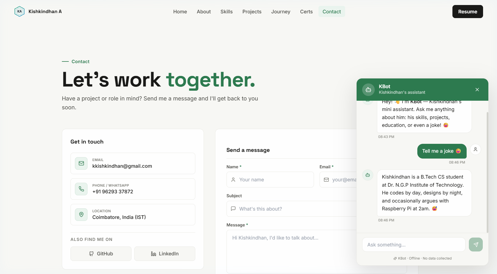

# Kishkindhan A. — Handcrafted Developer Portfolio

<div align="center">


### 🌿 Full-Stack Engineering • AI/ML & Computer Vision • Internet of Things (IoT) • Thoughtful Product Design

[](https://react.dev/)
[](https://www.typescriptlang.org/)
[](https://vitejs.dev/)
[](https://tailwindcss.com/)
[](https://threejs.org/)
[](https://www.framer.com/motion/)

[Overview](#-overview) • [UI Showcase](#-visual-ui-showcase) • [Interactive Chatbot](#-interactive-mini-chatbot) • [Features](#-key-features) • [Tech Stack](#-tech-stack) • [Quick Start](#-quick-start)

</div>

---

## 📖 Overview

A bespoke personal developer portfolio engineered for **Kishkindhan A.**, designed from scratch with a **human-crafted, editorial UI/UX design system**. Moving away from generic template tropes, this experience pairs thoughtful typography, a calming warm porcelain canvas (`#FAFCFF`), crisp slate architectural borders, and an interactive 3D WebGL globe with rich tactile micro-interactions and an **interactive personality chatbot**.

---

## 🖥️ Visual UI Showcase

### 1. Hero & Interactive 3D Globe
> Clean editorial typography, authentic developer badge, quick-action contact CTAs, and a procedural Three.js WebGL globe with subtle atmospheric orbits. Includes floating launcher button for the interactive chatbot on the bottom right.

<p align="center">
  
</p>

---

### 2. Interactive Mini Chatbot (KBot)
> A playful, interactive floating assistant resting in the bottom-right corner. Packed with humorous developer responses, Easter eggs, joke telling, and instant answers to queries regarding Kishkindhan's skills, projects, and contact info.

<p align="center">
  
</p>

---

### 3. About & Core Capabilities
> Comprehensive bio and academic background (B.Tech Computer Science & Business Systems at Dr. N.G.P. Institute of Technology). Includes personal portrait, verifiable skills breakdown, and resume download.

<p align="center">
  
</p>

---

### 4. Skills & Technologies (with IoT Specialization)
> Categorized tech stack cards organized into **Languages**, **Web Development**, **Internet of Things (IoT)**, **Databases**, **Dev Tools**, and **Systems**, featuring real experience tags and clean pill styling.

<p align="center">
  
</p>

---

### 5. Selected Projects Showcase
> Curated showcase highlighting production-tested engineering across AI, IoT, Web, and Computer Vision:
> - **Farm To Home** — Fresh produce logistics with smart IoT tracking
> - **Driver Safety & Attention Monitor** — Computer vision safety system powered by Raspberry Pi
> - **EcoTrack** — Carbon footprint monitoring & AI recommendations
> - **Smart Energy Meter** — Blockchain & ESP32 IoT automated billing
> - **AI Rockfall Prediction** — Geotechnical hazard classification in mining
> - **Food Time** — High-fidelity modern ordering UI/UX design

<p align="center">
  
</p>

---

### 6. Journey & Experience Timeline
> Vertical chronological timeline highlighting academic milestones at Dr. N.G.P. iTech and real-world internship experience at Sri Nandha Infotech with clean status badges.

<p align="center">
  
</p>

---

### 7. Certifications & Credentials
> Verified credentials including NPTEL Cloud Computing and Cybersecurity & Ethical Hacking courses with credential IDs, verification links, and scores.

<p align="center">
  
</p>

---

### 8. Contact & Interactive Connect
> Resilient contact form with real-time feedback, serverless email API integration, direct phone and email cards, and active GitHub / LinkedIn channels.

<p align="center">
  
</p>

---

## 🤖 Interactive Mini Chatbot

The bottom-right corner features **KBot**, a custom conversational widget crafted specifically for this portfolio:
- **Instant Toggle**: Open and close smoothly with animated spring transitions.
- **Smart Offline Matching**: Fast fuzzy keyword engine answering questions regarding:
  - *Who made this portfolio?*
  - *What projects did Kishkindhan build?*
  - *What IoT and web technologies does he know?*
  - *How can I hire or contact him?*
  - *Tell me a programmer joke!*
- **Quick-Prompt Chips**: Clickable suggestions for rapid interaction.
- **Sound Feedback**: Subtle Web Audio API pops and chime sounds on interaction.
- **Human Touch & Humor**: Witty, friendly, self-aware responses that make visiting the portfolio memorable.

---

## ✨ Key Features

- 🌿 **Handcrafted Human-Made Aesthetics**: Warm porcelain canvas, authentic editorial typography, subtle emerald borders, and zero AI cliches.
- 💬 **Integrated Floating Assistant**: Interactive chatbot widget with humor, project recommendations, and instant FAQs.
- 🌍 **Interactive 3D Three.js Globe**: Real-time WebGL canvas with emerald continents, orbital rings, and smooth rotation.
- ⚡ **Lightning Fast Vite 6**: Instant HMR and high-efficiency production bundling.
- 📱 **Fully Responsive Layout**: Adaptive multi-column grid system tuned across mobile, tablet, laptop, and 4K desktop screens.
- ♿ **Accessibility First**: WCAG AAA compliant contrast ratios and smooth layout transitions.
- 📬 **Serverless Contact Form**: Protected API endpoint integration for direct messaging.

---

## 🛠️ Tech Stack

| Category | Technologies |
| :--- | :--- |
| **Frontend Core** | React 18, TypeScript, Vite 6 |
| **Styling & Design** | Tailwind CSS, Custom Editorial Design System, CSS Variables |
| **Motion & Animation** | Framer Motion, CSS Keyframes |
| **3D & Graphics** | Three.js, React Three Fiber, HTML5 Canvas 2D |
| **Icons & Typography** | Lucide React, Plus Jakarta Sans, Inter, JetBrains Mono |
| **Routing** | React Router v6 |
| **Audio** | Web Audio API synthetic sound effects |
| **Hardware & IoT** | Raspberry Pi, ESP32, Arduino, MQTT, Sensors |

---

## 🚀 Quick Start

### Prerequisites
- [Node.js](https://nodejs.org/) (version 18.0 or newer)
- npm or yarn

### 1. Clone & Install
```bash
git clone https://github.com/Kishkindhan-A/portflio.git
cd portflio
npm install
```

### 2. Run Locally
```bash
npm run dev
```
Open your browser at `http://localhost:5173`.

### 3. Production Build
```bash
npm run build
```
Generates an optimized production bundle in the `dist/` folder.

---

## 📁 Project Structure

```text
portflio/
├── docs/
│   └── screenshots/       # UI showcase screenshots for documentation
│       ├── hero.png
│       ├── chatbot.png
│       ├── about.png
│       ├── skills.png
│       ├── projects.png
│       ├── journey.png
│       ├── certifications.png
│       └── contact.png
├── public/
│   └── assets/            # Static images, resume PDF, project media
├── src/
│   ├── components/        # UI modules (Navbar, Hero, About, Skills, Projects, Chatbot, Contact, Footer)
│   │   └── Chatbot/       # Interactive floating chatbot widget
│   ├── data/              # Typed data models (profile, skills, projects, chatbot responses)
│   ├── hooks/             # Custom hooks (scroll, audio, navigation)
│   ├── pages/             # Page views (Home, About, Skills, Projects, Journey, Certs, Contact)
│   ├── scenes/Globe/      # Three.js 3D Earth and particle effects
│   ├── App.tsx            # Main application router and root layout
│   ├── index.css          # Design system tokens and layout utilities
│   └── main.tsx           # React DOM root entry
├── tailwind.config.js     # Tailwind color schemes & typography extensions
└── vite.config.ts         # Vite build configuration
```

---

## 📬 Contact & Connect

- **Portfolio**: [Kishkindhan A.](http://localhost:5173/)
- **Email**: [kkishkindhan@gmail.com](mailto:kkishkindhan@gmail.com)
- **LinkedIn**: [linkedin.com/in/kishkindhan-a-614143302](https://www.linkedin.com/in/kishkindhan-a-614143302)
- **GitHub**: [github.com/Kishkindhan-A](https://github.com/Kishkindhan-A)

---

<div align="center">
  <sub>Crafted with passion, code, and care by Kishkindhan A. © 2026</sub>
</div>
