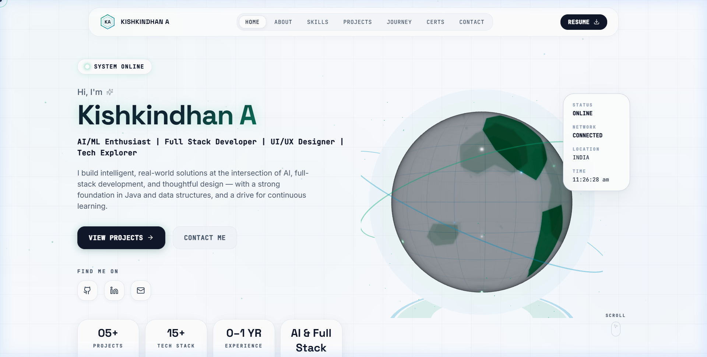
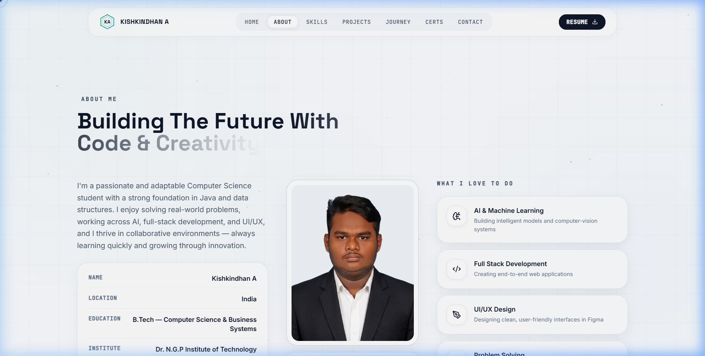
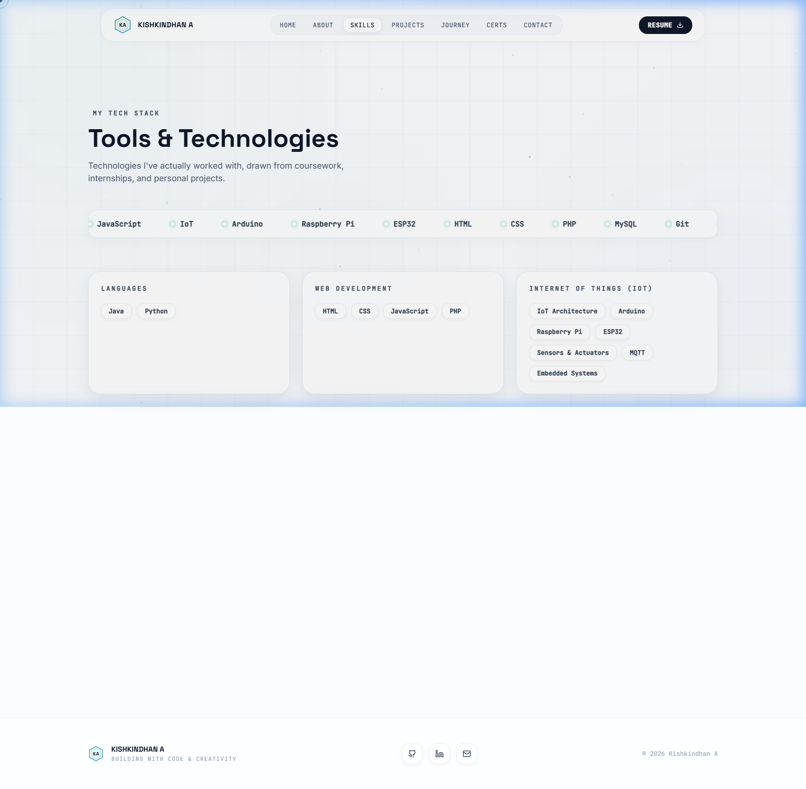
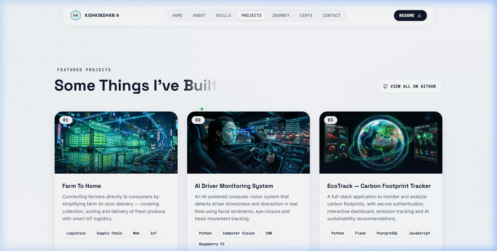
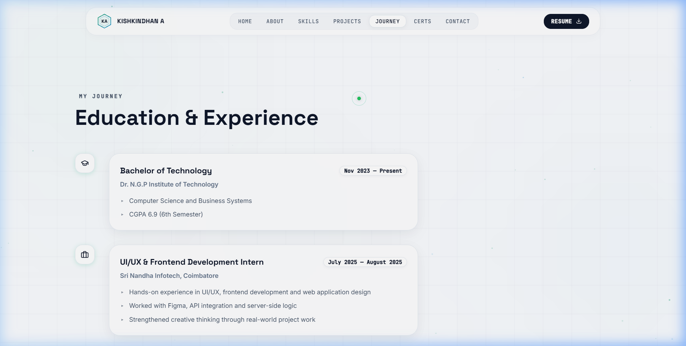
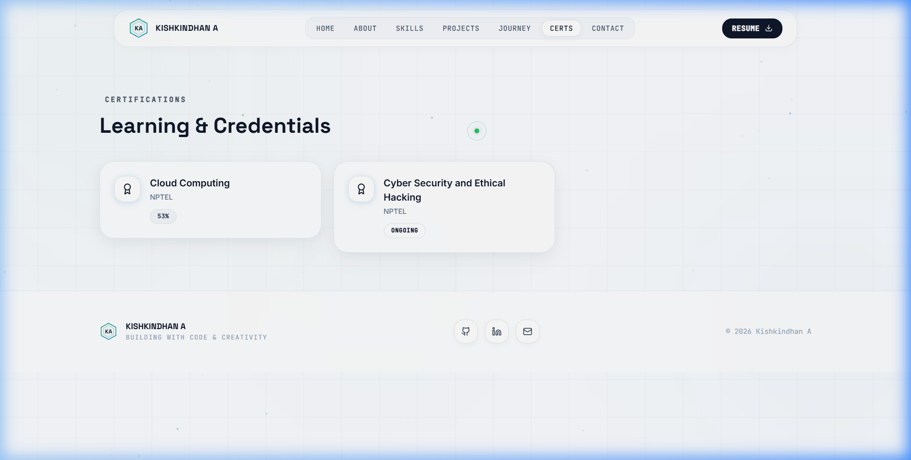
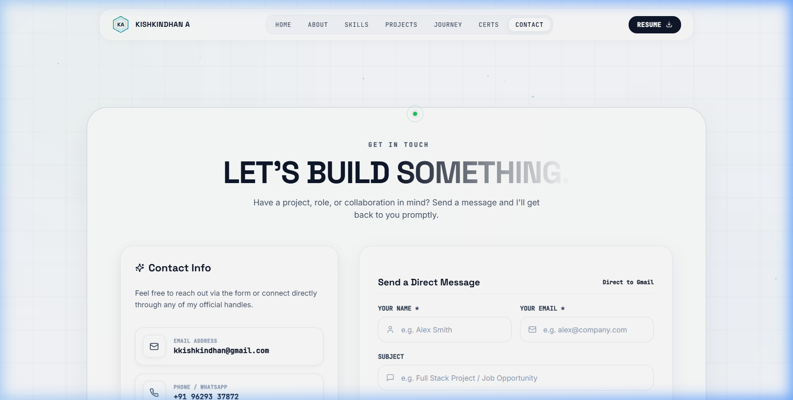

# Kishkindhan A. — Developer Portfolio

<div align="center">



### 🌟 Intelligent Solutions • AI/ML • IoT • Full Stack Development • Thoughtful UI/UX

[](https://react.dev/)
[](https://www.typescriptlang.org/)
[](https://vitejs.dev/)
[](https://tailwindcss.com/)
[](https://threejs.org/)
[](https://www.framer.com/motion/)

[Live Demo](http://localhost:5173/) • [Features](#-key-features) • [UI Showcase](#-visual-ui-showcase) • [Tech Stack](#-tech-stack) • [Quick Start](#-quick-start)

</div>

---

## 📖 Overview

A state-of-the-art personal developer portfolio engineered for **Kishkindhan A.**, built with modern web technologies, a luxury frosted glassmorphism design system, high-contrast typography, interactive 3D WebGL graphics, and seamless client-side routing.

Designed with an aesthetic featuring **porcelain white canvas (`#FAFCFF`)**, **emerald green (`#10B981`)** & **electric sky (`#0284C7`)** accents, and **deep slate navy (`#0F172A`)** text ensuring WCAG AAA legibility.

---

## 🖥️ Visual UI Showcase

### 1. Hero & Interactive 3D Globe
> Featuring a procedural Three.js glass Earth with glowing atmospheric orbits, live system telemetry HUD (`STATUS: ONLINE`), quick CTAs, and interactive floating particles.

<p align="center">
  
</p>

---

### 2. About & Core Capabilities
> Comprehensive developer bio, academic background (B.Tech CSBS at Dr. N.G.P. iTech), downloadable resume CTA, capability cards with custom micro-interactions, and high-fidelity architectural portrait.

<p align="center">
  
</p>

---

### 3. Skills & Technologies (with IoT Integration)
> Infinite-loop animated marquee ticker on frosted glass, categorized tech pills covering **Internet of Things (IoT)**, **Languages**, **Web Development**, **Databases**, **Dev Tools**, **Systems**, **Cybersecurity**, and **Cloud**.

<p align="center">
  
</p>

---

### 4. Selected Projects Showcase
> High-impact project showcase highlighting real-world applications across AI, IoT, Web, and Blockchain with interactive filters and live demo links:
> - **Farm To Home** — Fresh produce logistics with smart IoT tracking
> - **AI Driver Monitoring System** — Computer vision safety powered by Raspberry Pi
> - **EcoTrack** — Carbon footprint monitoring & AI recommendations
> - **Smart Energy Meter** — Blockchain & ESP32 IoT automated billing
> - **AI Rockfall Prediction** — Geotechnical hazard classification in mining
> - **Food Time** — High-fidelity modern ordering UI/UX design

<p align="center">
  
</p>

---

### 5. Journey & Experience Timeline
> Vertical interactive timeline showcasing education, leadership milestones, and tech experience with glowing emerald node indicators and date badges.

<p align="center">
  
</p>

---

### 6. Certifications & Credentials
> Verified credentials including NPTEL Cloud Computing and Cybersecurity with direct verification links, issued credentials IDs, and progress indicators.

<p align="center">
  
</p>

---

### 7. Contact & Interactive Connect
> Resilient contact form with real-time feedback, serverless Resend email API integration, direct phone/email contact panels, and interactive social links.

<p align="center">
  
</p>

---

## ✨ Key Features

- 💎 **Luxury Frosted Glassmorphism**: Tailored `backdrop-filter` blur with refined border highlights and ambient glowing auras.
- 🌍 **Interactive 3D Three.js Globe**: Real-time WebGL canvas with procedural emerald continents and turquoise orbital rings.
- ⚡ **Lightning Fast Vite 6**: Instant HMR and optimized production asset bundling.
- 📱 **Fully Responsive Layout**: Adaptive multi-column grid system tuned for 4K desktop, laptops, tablets, and smartphones.
- ♿ **Accessibility & Motion First**: Full support for `prefers-reduced-motion` and WCAG AAA compliant contrast ratios.
- 🎯 **Interactive Custom Cursor**: Dual-ring physics cursor with hover scale micro-animations on interactive elements.
- 📬 **Secure Serverless Contact Form**: Protected Vercel API endpoint powered by Resend for instant message delivery.

---

## 🛠️ Tech Stack

| Category | Technologies |
| :--- | :--- |
| **Frontend Core** | React 18, TypeScript, Vite 6 |
| **Styling & Design** | Tailwind CSS, Custom Glassmorphism System, CSS Variables |
| **Motion & Animation** | Framer Motion, CSS Keyframes |
| **3D & Graphics** | Three.js, React Three Fiber, HTML5 Canvas 2D Particles |
| **Icons & Typography** | Lucide React, Space Grotesk, Inter, JetBrains Mono |
| **Routing** | React Router v6 |
| **Backend / API** | Vercel Serverless Functions, Resend API |
| **Hardware & IoT** | Arduino, Raspberry Pi, ESP32, MQTT, Sensors |

---

## 🚀 Quick Start

### Prerequisites
- [Node.js](https://nodejs.org/) (version 18.0 or newer)
- npm or yarn

### 1. Clone & Install
```bash
git clone https://github.com/Kishkindhan-A/portfolio.git
cd portfolio
npm install
```

### 2. Run Locally
```bash
npm run dev
```
Open your browser at `http://localhost:5173`.

### 3. Production Build
```bash
npm run build
```
Generates an optimized production bundle in the `dist/` folder.

---

## 📁 Project Structure

```text
portfolio/
├── docs/
│   └── screenshots/       # UI showcase screenshots for documentation
├── public/
│   └── assets/            # Static images, resume PDF, project media
├── src/
│   ├── components/        # UI modules (Navbar, Hero, About, Skills, Projects, Contact, Footer)
│   ├── data/              # Typed data models (profile, skills, projects, experience, education)
│   ├── hooks/             # Custom hooks (reduced-motion, scroll, cursor tracking)
│   ├── pages/             # Page views (Home, About, Skills, Projects, Journey, Certs, Contact)
│   ├── scenes/Globe/      # Three.js 3D Earth and particle effects
│   ├── App.tsx            # Main application router and root layout
│   ├── index.css          # Design system tokens and glassmorphism utilities
│   └── main.tsx           # React DOM root entry
├── api/
│   └── contact.ts         # Serverless contact form email handler
├── tailwind.config.js     # Tailwind color schemes & animation extensions
└── vite.config.ts         # Vite build configuration
```

---

## 📬 Contact & Connect

- **Portfolio**: [Kishkindhan A.](http://localhost:5173/)
- **Email**: [kkishkindhan@gmail.com](mailto:kkishkindhan@gmail.com)
- **LinkedIn**: [linkedin.com/in/kishkindhan-a-614143302](https://www.linkedin.com/in/kishkindhan-a-614143302)
- **GitHub**: [github.com/Kishkindhan-A](https://github.com/Kishkindhan-A)

---

<div align="center">
  <sub>Crafted with passion, code, and creativity by Kishkindhan A. © 2026</sub>
</div>
